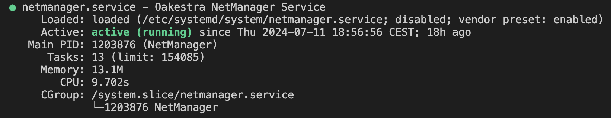

[](https://github.com/oakestra/oakestra-net/tree/v0.4.301)
[]()

# Oakestra Net 🕸️🌳🕸️
This component enables the communication between services distributed across multiple [Oakestra](oakestra.io) nodes and clsuters.

This repository includes:

- **Net Manager**: The network daemon that needs to be installed on each Worker Node. This captures the services traffic, and creates the semantic overlay abstraction. See [Semantic Addressing](https://www.oakestra.io/docs/networking/semantic-addressing) for details.

- **Root/Cluster Service Managers**: Control plane components installed alongside Oakestra root and cluster orchestrators. They propagate and install the routes to the Net Manager components. 

>This networking component creates a semantic addressing space where the IP addresses not only represent the final destination for a packet
but also enforces a balancing policy.

## How to install the Net Manager daemon

### From official build

Follow the offical Oakestra [Get Started](https://github.com/oakestra/oakestra?tab=readme-ov-file#your-first-worker-node-🍃) guide to install the stable NetManager alongside oakestra worker node. 

### Build it on your own
Go inside the folder `node-net-manager/build` and run:
```
./build.sh
```

Then move the binary corresponding to your architecture to the current folder:
```
cp bin/<architecture>-NetManager .
```
> <architecture> is either arm-7 or amd64

Finally, install it using 
`./install.sh` 

## Run the NetManager daemon

Configure the Network Manager by editing `/etc/netmanager/netcfg.json` as follows:

```json
{
  "NodePublicAddress": "<IP ADDRESS OF THIS DEVICE>",
  "NodePublicPort": "<PORT REACHABLE FROM OUTSIDE, use 50103 as default>",
  "ClusterUrl": "<IP Address of cluster orchestrator or 0.0.0.0 if deployed on the same machine>",
  "ClusterMqttPort": "10003"
}
```


Then start the NetManager
```
sudo systemctl start netmanager
```

Verify the daemon status with:
```
sudo systemctl status netmanager
```


You can enable the daemon start at system startup with
```
sudo systemctl enable netmanager
```

The daemon logs are under
```
/var/log/oakestra/netmanager.log
```


